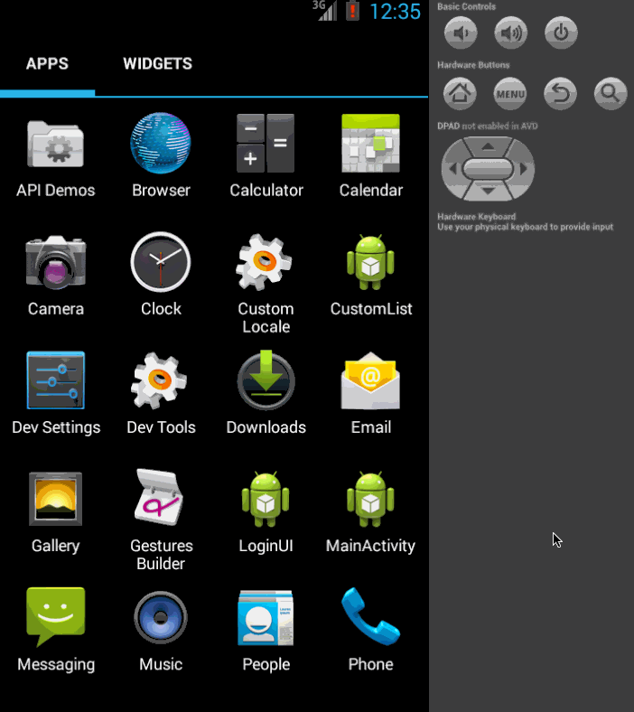

/Users/adam701/TipCalculator
fasttravel-lm:TipCalculator adam701$ emacs README.md

Tip Caculator
===================================================

1. How many hours did it take to complete?

   4 Hours

2. Which required and optional stories have you completed?

Completed:

    1. User is displayed the tip of specified percentage for specified entered amount

    2. User enters the total amount of the transaction

    3. Upon selecting tip amount, formatted tip value is displayed

    4. (Optional) User changes the total amount and updated tip is reflected automatically

    5. (Optional) User can select custom tip percentage if desired

    6. (Optional) User can select how many ways to split the tip

    7. (Optional) User can edit preset tip percentages and have them persist across launches

    8. (Optional) Experiment with trying input widgets to replace the buttons and/or textviews

    9. Add a new option: Tip Calculation based on Subtotal or Subtotal + Tax

3. Walkthrough of all user stories:

GIF created with [LiceCap](http://www.cockos.com/licecap/).

